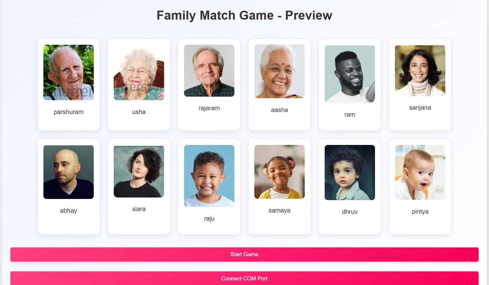

# 🎮 GameTherapy: Interactive Mental Health Gaming Platform
Welcome to **Game Therapy**, an adaptive gaming platform designed to support individuals with cognitive, social, and emotional challenges. Our solution combines innovative games, real-time AI support, and gesture-based controls to create a personalized therapeutic experience.

---

## What is Game Therapy?

Game Therapy addresses the unique needs of people with mental challenges by providing:
## ✨ Features

✅ **Family Tree Game**: Helps dyslexic users recognize names using Arduino-based hand gestures.  
✅ **Astra Maze**: Interactive ball maze controlled via motion tracking.  
✅ **AI Therapy Chatbot**: Provides emotional support using Llama and LLM-based AI.  
✅ **Guardian Dashboard**: Tracks player progress with visual charts.  
✅ **Community Support**: Users can chat with others in a safe environment.  


---

## Interactive Features

### Family Tree
- **Dyslexia-Friendly Game:**  
  Players use Arduino-based hand gestures to indicate whether a displayed name is correct by moving their hand left or right.

<div align="center">
  
</div>

### Astra
- **Maze Navigation:**  
  Control a ball through a maze using hand gestures, enhancing motor skills and spatial awareness.

<div align="center">
  
</div>

### AI Chatbot & Guardian Dashboard
- **Real-Time AI Support:**  
  Chat with our AI therapist (powered by Llama and other LLMs) for personalized emotional support.
- **Progress Tracking:**  
  Guardians can view interactive charts and analytics to monitor a player’s progress.
- **Community Interaction:**  
  Engage with a built-in chat platform to share experiences and insights.

<div align="center">
  
</div>

---


## Video Demonstration

Watch our detailed walkthrough of Game Therapy:

[](https://www.youtube.com/watch?v=Lg2mKiUPsIM)

*Click the image above to watch the video demonstration.*

---

## Technologies Used

- **Frontend:** React.js, HTML5, CSS3
- **Backend:** Node.js, Express.js
- **Database:** MongoDB
- **Machine Learning:** TensorFlow, Hugging Face
- **AI Chatbot:** Llama and other LLMs
- **Communication & APIs:** Twilio, Google APIs
- **Hardware Integration:** Arduino (for gesture-based controls)

---

## 🚀 Installation and Setup

1. **Clone the Repository:**
   ```bash
   git clone https://github.com/vikasp07/Game-Theraphy.git
   cd Game-Theraphy
